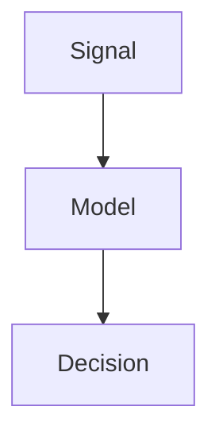

# Contribute to Dexter Oculus

This repository is an Astro-powered portfolio and technical notes site.

1. Install dependencies with `npm install`.
1. Start local development with `npm run dev`.
1. Verify production output with `npm run build`.
1. Keep project content in `_projects/`, notes in `_posts/`, and profile data in `_data/`.
1. Keep visual changes aligned with `guideline.html`: black and white surfaces, yellow focus states, restrained contour geometry, and compact tactical panels.

## Writing Notes

Inline math uses `$E = mc^2$`, and block math uses:

```tex
$$
\int_0^\infty e^{-x}\,dx = 1
$$
```

Diagrams and graph-like visuals can be written with Mermaid:

````markdown

````

Markdown files can also include raw HTML or inline SVG when a custom graphic is clearer than a diagram.

Data plots and function graphs use `chart` JSON blocks. Supported `kind` values are `bar`, `box`, `line`, `scatter`, and `function`.

````markdown
```chart
{
  "kind": "bar",
  "title": "Model Accuracy",
  "xLabel": "Model",
  "yLabel": "Accuracy",
  "x": ["GRU", "Transformer", "ACT"],
  "y": [0.81, 0.87, 0.9]
}
```
````

For 3D data visualization, pass Plotly traces directly:

````markdown
```chart
{
  "title": "3D Surface",
  "traces": [
    {
      "type": "surface",
      "z": [[0, 1, 0], [1, 2, 1], [0, 1, 0]]
    }
  ],
  "layout": {
    "scene": {
      "xaxis": { "title": "x" },
      "yaxis": { "title": "y" },
      "zaxis": { "title": "z" }
    }
  }
}
```
````

Simple Three.js scenes use `three` JSON blocks:

````markdown
```three
{
  "shape": "torus",
  "color": "#febb0c",
  "camera": [3, 2.2, 4],
  "wireframe": false,
  "animate": true
}
```
````

````markdown
```chart
{
  "kind": "box",
  "title": "Latency Distribution",
  "yLabel": "ms",
  "groups": {
    "edge": [18, 21, 19, 26, 23, 20],
    "server": [42, 38, 45, 49, 41, 44]
  }
}
```
````

````markdown
```chart
{
  "kind": "function",
  "title": "Function Shape",
  "expression": "sin(x) + 0.2*x",
  "domain": [-10, 10],
  "samples": 600,
  "xLabel": "x",
  "yLabel": "f(x)"
}
```
````
